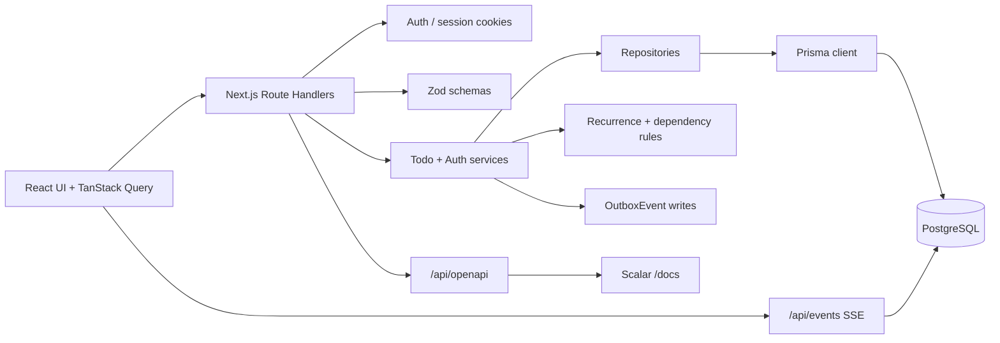
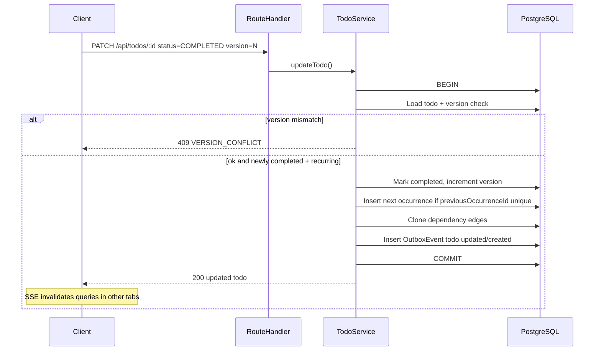

# Architecture

## Component view

## Runtime packaging

`docker compose up --build` starts two containers, `app` and `postgres`, serving **http://localhost:3005**. The entrypoint waits for the database, applies migrations, and seeds only when the table is empty.

## Visibility / ownership

- `Todo.ownerId = null` → shared board (anonymous readable/writable; concurrent edits use `version`).
- Signed-in user → shared todos **plus** own todos; owned writes require owning session.

## Request flow (complete recurring todo)

## Data model (simplified)

- `User` / `Session`: email/password auth via httpOnly cookie.
- `Todo`: core fields, recurrence metadata, `version`, `completedAt`, `deletedAt`, optional `previousOccurrenceId` (unique), optional `ownerId`.
- `TodoDependency`: self-join (`todoId` depends on `dependsOnTodoId`).
- `OutboxEvent`: append-only stream for realtime invalidation.

## Concurrency notes

- Completing the same recurring todo twice concurrently: one writer wins the version update; unique `previousOccurrenceId` ensures at most one next task.
- Moving a blocked todo to `IN_PROGRESS` returns `409 BLOCKED_BY_DEPENDENCIES`.
- Soft-deleted rows are excluded from normal lists and dashboard aggregates.
- Stale `version` updates return `409 VERSION_CONFLICT`.
- Outbox events older than 1 day are pruned during SSE polling (invalidation stream, not a durable event store).
